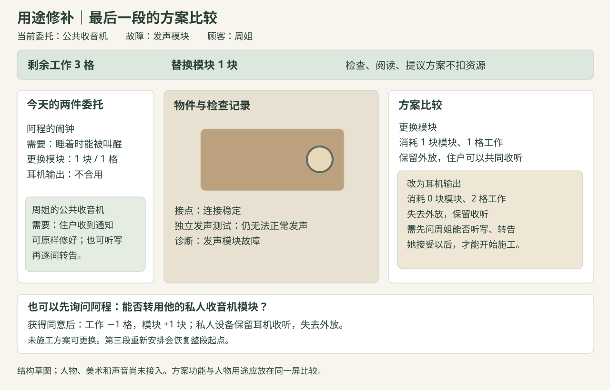

# 02｜Demo 玩法与玩家体验

2026-09-24　题前方案。[方向依据](01_TapTap风向与玩家分析.md)｜[关卡与制作安排](03_工作计划与关卡推演.md)｜[配置与资源交接](04_策划结构配置与美术准备.md)

## 一、游戏做什么

玩家经营一间临时修补铺，接待带着旧物来求助的街坊。玩家先检查物件，根据测试结果判断故障，再结合顾客的实际用途，提出原样修复或保留部分功能的改装方案。修好一件东西以后，顾客会把它带回生活中；有些人还会回来，让玩家看见这次处理造成的变化。

本作优先提供**观察、理解和解决问题的成就感**。经营场所负责组织委托、人物和工作安排，推荐版暂不加入进货、自由定价、现金日结与破产。首个 Demo 集中制作三个段落、四件委托，以及最后一段中两件委托的共同安排。

这里需要区分两类判断：

- **故障判断有明确依据。** 相似的“声音断断续续”，可以由接点松动或发声模块损坏造成，测试结果帮助玩家排除其中一种。
- **修补方案要看使用需要。** 一件设备改成耳机输出后仍能收听，但无法外放；顾客是否能接受，要看他拿这件东西做什么。

玩家逐渐掌握的是本作的几条维修规则和使用条件。游戏不教授真实电器维修，也不要求玩家已有相关知识。下文以发声设备为例，正式题材和名称等命题公布后再确定。

## 二、玩家怎样完成第一件委托

工人阿程把收音机放在柜台上，说声音时有时无。收音机仍能通电，玩家点击【试听】，看见播放指示变化，同时听到断续声音。文字记录保留“能通电，声音断续”，听不清声音的玩家也能取得同样的信息。

工作台提供【检查接点】和【单独测试发声模块】。本例中，前者显示“轻触接点，声音随之变化”；后者显示“独立测试时发声正常”。工具卡说明：发声模块正常、连接处又会影响声音，可以先检查接点。

玩家选择“接点松动”，故障标记留在物件旁，随后查看【重新接好】方案。方案写明需要一格工作量、不消耗替换模块、保留原功能。阿程确认后，玩家点击【开始修补】，工作格扣除一格，画面上的断线补齐，试听恢复稳定。

**观察和试装不消耗稀缺资源，确认施工以后才扣除。** 如果判断错误，测试面板指出与该判断冲突的现象，保留物件和已看记录，让玩家继续检查。第一件委托的重点是建立“现象—检查—判断—处理”的联系，暂不叠加抢时间和资源不足。

最后，阿程请玩家把收音机留在店里，等下班后再取。他提到，自己和孩子平时会一起听比赛转播。这句话给物件补充用途，也为后面的选择留下具体关系。

## 三、修补操作的规则

### 3.1 检查与判断

每件委托显示顾客描述、物件外观和已完成的检查记录。当前只设计接点、发声模块两类故障；工具最多两个。检查结果是预先编写的现象，程序不模拟电路，也不调用模型临时生成答案。

当玩家点击工具，工作台播放相应表现，并将结果记录在当前委托下。再次检查只重播结果。玩家可以随时回看工具卡和顾客需求，阅读与检查均不扣工作格。

完成至少一次检查后可以提交故障判断。正确则开放修补方案；错误则指出不相符的现象，不直接吞掉材料。提示分两层：先提醒尚未利用的记录，玩家主动求助后再解释判断关系。判断失败的次数可以作为试玩观察，界面不以次数惩罚玩家。

第二件委托沿用相同工具，但改变故障原因。它用来检查玩家是否理解了前一次反馈：如果只是记住“声音断续就接线”，这一次会遇到明确的反例。

### 3.2 方案是否合用

方案卡写明修补以后**保留的功能、失去的功能、需要的工作格与模块数**。顾客的必需用途始终显示在同一画面。玩家可以提出技术上可行、用途上不合适的方案，顾客会说明拒绝原因；没有同意施工，就不扣资源。

例如，夜班工人的闹钟必须在他睡着时把他叫醒。改成耳机输出可以让设备发声，但他睡觉时不会戴耳机。因此，这个方案无法完成本次委托。公共收音机的管理员则可以接受耳机输出，前提是由自己听完消息，再写成通知逐间转告。

同一修法在两件委托中会得到不同回答。**玩家需要读懂的是功能与用途的关系。** 不能只按照“消耗更少”或者“修复程度更高”选择。

### 3.3 工作安排与共享零件

前两段各处理一件委托，供给足够完成教学。最后一段同时显示闹钟和公共收音机，玩家拥有 **1 块替换模块、3 格工作量**。两张委托共同使用这些资源，先做完一单会改变另一单能选择的方案。

工作格是本作对维修时间的简化表示。检查、看说明和询问免费；方案确认后按表扣除。它不会随真实时间流逝，玩家可以停下来阅读。

| 处理 | 模块变化 | 工作格消耗 | 实际结果 |
|---|---:|---:|---|
| 闹钟：更换发声模块 | −1 | 1 | 保留外放与定时叫醒功能，工人接受 |
| 闹钟：改成耳机输出 | 0 | 2 | 无法在睡眠中叫醒使用者，工人拒绝，不扣资源 |
| 公共收音机：更换模块 | −1 | 1 | 可让多人同时收听，管理员接受 |
| 公共收音机：改成耳机输出 | 0 | 2 | 保留收听，失去外放；管理员同意听写并转告后接受 |
| 经主人同意，从旧收音机转用模块 | ＋1 | 1 | 旧收音机保留耳机收听，失去外放；整段限一次 |

阿程的旧收音机是第一段修好的那台。玩家需要先询问，他才会提出让出模块的条件：保留耳机收听，并明确告诉他外放无法保留。没有同意时，施工按钮不可用。资源短缺由两个人共同面对，顾客也能提出办法。

### 3.4 两种能完成委托的安排

**安排一：保留旧收音机。** 用唯一模块修闹钟，占一格；公共收音机改为耳机输出，占两格。两件委托都解决了必需用途，阿程保留家用收音机，管理员多承担听写和转告的工作。

**安排二：同意转用模块。** 从旧收音机取得一块模块，占一格；再用两块模块分别修闹钟和公共收音机，各占一格。两件设备都恢复原样，阿程的私人收音机失去外放。回访中，管理员可以提出让他和孩子来公共收音机前一起听转播。

两种安排都消耗三格工作量。结果的差别落在谁多做一份工作、哪件物品失去功能、之后怎样使用。结尾分别呈现这些后果，不把它们合成一个“善良值”。

玩家也可以只处理一件。结束本段前，界面列出尚未解决的用途和剩余资源，确认后照实进入后续。供给不足的提示需要说明缺什么；顾客拒绝的提示需要说明方案哪里不合用。

### 3.5 重排与恢复

未施工的方案可随时更换。最后一段提供【重新安排】，恢复该段开始时的物件、模块、工作格、施工记录与顾客同意状态。界面要说明它会撤销这一段的处理，不能只恢复库存而保留已经修好的物件。

这种恢复方式让玩家比较安排，更适合短篇解谜。剧情依然回应当前这一次的结果，不以“绝对不可回头”制造压力。整局结束后可以从头开始；跨次启动的存档暂不属于首个 Demo。

## 四、界面与反馈

左侧放委托和使用需要，中间放物件及检查工具，右侧放已取得的证据和故障判断。确认故障后，右侧切换为方案比较；最后一段还需能同时看见另一件委托和共用资源。

画面可以有景深，操作区要清楚。远处墙面、窗户和货架降低细节，中间物件保持完整轮廓，两侧前景只承担遮挡与气氛。文字和工具图标独立绘制，不随背景柔化。声音和灯光共同表现变化，重要结果始终有文字记录。

第一件委托安排一次完整的修好反馈：声音稳定、连接恢复、顾客试用。这段表现会反复使用，因此值得打磨。物件旋转、自由拆螺丝和复杂拖拽需要单独制作输入、模型和动画，首版采用固定视角与点选。

## 五、最少需要做完哪些内容

标准 Demo 保留 **3 个段落、4 件委托、2 位顾客、2 类故障、2 个检查工具、3 种普通修补操作和1次授权转用**。其中，重新接好用于接点故障，更换模块与耳机改装用于发声故障。最后一段复用前面的人物与工具。

三种物件轮廓即可组织内容：收音机、门铃、闹钟。私人和公共收音机共用结构，外壳、标签和使用痕迹不同。主场景只做一套；修好、检查与转用通过局部差分、声音和文字表现。

每人只能投入 12 小时时，可以删除独立的第二段，把门铃案例并入工具卡练习，保留第一件委托与最后两件共同安排。这样仍有教学、用途冲突和回访，具体制作能否压入 12 小时，要先看题前样例的接入速度。

## 六、玩家能力与节奏

前段先教会观察和测试，中段要求区分相似症状，后段再将技术判断与人物用途结合。玩家掌握工具以后，应有机会用得更熟练；不要每到下一段就换一套按钮和术语。

对于偏解谜的玩家，挑战来自证据和条件的关系；对于偏故事的玩家，检查记录、工具卡和逐层提示可以减轻记忆负担。喜欢纯放松整理的玩家可能仍觉得这些判断偏重，因此第一稿把他们列为另一个方向的目标群体。

GameFlow 对目标、反馈、控制和技能挑战关系的讨论，可以用于检查这段学习过程；SDT 对胜任、自主和关联的讨论，则帮助解释玩家为何愿意继续。[GameFlow](https://doi.org/10.1145/1077246.1077253)、[游戏动机研究](https://selfdeterminationtheory.org/SDT/documents/2010_PrzybylskiRigbyRyan_ROGP.pdf)

这些框架不能代替试玩。首轮重点观察三件事：玩家能否用测试结果解释故障；相同修法放到不同人身上，是否会改变选择；回访时是否记得自己处理过的物件与用途。若诊断只变成依次点完两个按钮，就要调整证据关系，或进一步缩短检查部分。
