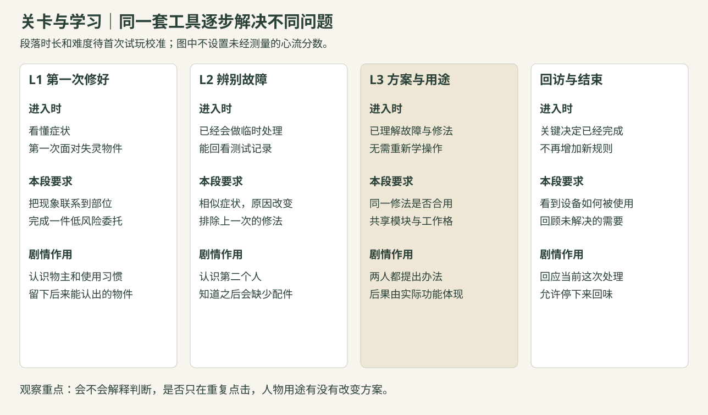
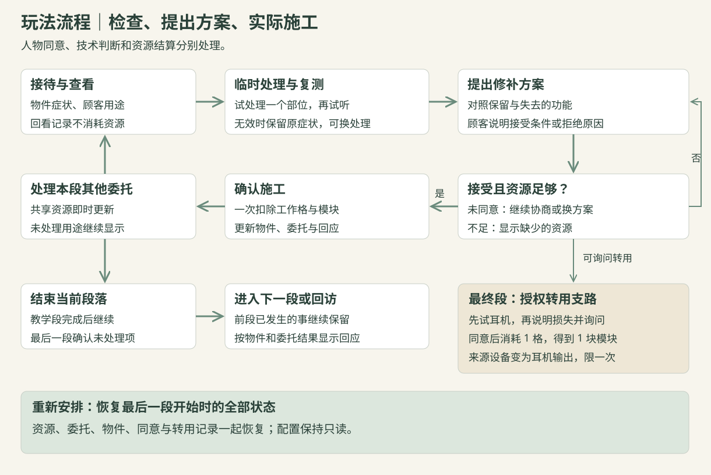

# 03｜剧情、关卡与制作安排

2026-09-24　题前方案。[玩家与方向](01_TapTap风向与玩家分析.md)｜[玩法规则](02_Demo元素与玩家体验.md)｜[配置与资源](04_策划结构配置与美术准备.md)

## 一、制作范围

推荐版是一段发生在临时修补铺里的短篇，共三个段落、四件委托。前三次接触逐步教会检查和方案判断，最后让两件委托共同使用有限资源。玩家可以在约 10—15 分钟内完成一段经历；实际时长按首次试玩调整。

程序采用固定视角、点选工具和方案卡。美术集中做一间店、两个人物，以及收音机、门铃、闹钟三类物件。收音机在故事中多次出现，私人和公共设备通过外壳与标签区分，检查位置沿用同一套结构。

正式投入以每人 24 小时为上限，题前工具学习另计。主程序、副程序 A、副程序 B 都会写程序，但 Godot 经验较少，预算中保留场景接线、数据读取、字体与导出排错时间。

## 二、剧情怎样从工作中展开

### 2.1 场所与人物

故事暂以临时宿舍启用前的一间修补铺为背景。部分旧型号设备已经停止配件供应，街坊搬来的东西还能使用，却很难按原样修好。店里的物件、停供通知与顾客需求共同说明这一处境，开头只交代眼前的工作。

阿程做夜班，下班后到店里取家里的收音机。他需要一只可靠的闹钟，也希望保留和孩子一起听转播的习惯。管理员周姐负责临时宿舍的入住安排，需要把通知送到每个住户；公共收音机能省下逐间转告的时间。

两个人都有自己的事要做。阿程可以提出转用自己设备的模块，周姐可以接受听写通知、逐间转告，也可以安排公共收听时段。玩家提供技术判断和工作安排，他们对功能损失有知情权，也能拒绝不合用的办法。

### 2.2 第一段：建立日常

阿程带来声音断续的私人收音机。外壳上有一条旧刻度贴纸，标着他和孩子常听的频率。玩家通过接点检查与独立发声测试，判断是连接问题，用一格工作量重新接好。

修补以后，试听从断续变为稳定。阿程请店里暂时保管，等下班后回来取。这里先让玩家认识物件与使用者，收音机后续是否保留外放，才会涉及已经建立的生活习惯。

### 2.3 第二段：同样没声音，原因不同

周姐带来宿舍的门铃。线路测试稳定，发声测试没有反应，原因与第一件不同。玩家更换模块后，门铃恢复响铃，周姐提到晚上还有公共收音机要处理。

她带来的纸条列着旧设备停供型号。玩家不需要记住一串型号，只需知道“后面能用的替换模块很少”。这条信息由工作引出，并为下一段的供给建立预期。

### 2.4 第三段：合用的办法

晚上停电检修之前，店里还剩三格工作量和一块替换模块。阿程的闹钟与周姐的公共收音机都需要发声模块，两人同时出现在柜台前。

玩家可以先问清各自要保留什么。阿程必须在睡着时被叫醒；周姐需要让住户及时知道安排，多人同时收听是较省事的方式，她也愿意听写后转告。这些条件在提出方案前就能看见。

如果玩家保留阿程的私人收音机，可以修好闹钟，再把公共设备改为耳机输出。回访中，周姐带回手写通知，提到哪几间房已经收到消息。若采用阿程主动提出的转用方案，则两件委托恢复外放，私人收音机只剩耳机收听；周姐可以提出以后在公共设备前安排一段共同收听时间。

两条路线都解决眼前的问题，也各自改变了之后的生活安排。结尾用设备状态、人物行动与一两句回话交代结果，保留玩家回想的空间。

### 2.5 四种叙事渠道的分工

顾客对话告诉玩家这件东西用来做什么，以及哪些功能可以舍弃。物品说明写能看到的刻痕、补线和标签，不代替人物解释内心。碎片记录补充停供、搬入和通知的关系，让背景制度影响一次实际工作。主线对话集中在接待、共同安排与回访，确认玩家已经参与的事情。

同一信息只需在合适的位置讲清。供给和功能损失属于决定前的信息，人物后续怎样回应则可以保留到回访。正式命题公布后，先看它能否改变这条工作与人物关系，再决定是否沿用这个故事。

## 三、关卡怎样逐步提高要求

| 段落 | 物件与已知现象 | 检查结果 | 玩家需要掌握什么 |
|---|---|---|---|
| L1 第一次修好 | 阿程的私人收音机能通电，播放断续 | 接点不稳定；独立发声正常 | 从两个现象判断连接问题，完成一次修补与试听 |
| L2 辨别相似故障 | 门铃能通电，但按下后不响 | 接点稳定；发声模块无反应 | 沿用工具，排除“所有没声音都重新接线”的错误经验 |
| L3 用途与安排 | 闹钟和公共收音机都存在发声故障 | 检查规则已经熟悉 | 闹钟需要独立叫醒，公共设备允许人工转告；比较功能损失、模块与工作量 |
| 回访 | 展示当前采用的物件状态 | 不再增加工具和新规则 | 看见自己的处理怎样进入人物的日常 |

第一段给出工具卡和一步提示；第二段退去操作提示，但保留记录；第三段主要考验方案与用途，诊断不再反复拖长。若玩家在第二段仍不能解释故障，就先调整反馈和例子，不急着增加第三种故障。

这里的成长主要体现为理解更准确、回看更少、能主动提出合用办法。相同工具的重复使用可以形成熟练感，前提是后一次判断利用了已经学到的关系。

图中按照段落展示能力和新要求，不使用未经测量的心流分数。剧情停顿也有作用：修好后的试听让玩家确认成果，回访让人有时间理解后果，节奏无需始终加压。

### 3.1 最后一段的两条完整解法

初始资源为模块 1、工作格 3。方案甲：闹钟更换模块，资源变为 0／2；公共收音机改为耳机输出，资源变为 0／0。两件委托完成，私人收音机保留外放，管理员承担转告。

方案乙：阿程同意转用私人收音机的模块，资源变为 2／2；两件委托各更换一块模块，各占一格，最后为 0／0。两件委托恢复外放，私人收音机改为耳机收听。

玩家也可以先修公共收音机，再讨论闹钟缺件的处理。此时需要明确显示剩余模块和工作量，让人知道是哪一步改变了后面的可选方案。提出不合用方案、尚未同意转用、资源不足，均在施工前说明原因。

## 四、流程与恢复

进入委托后，玩家先取得顾客描述，再检查和判断故障；诊断正确后提出方案，顾客接受且资源足够时才能施工。施工完成后播放物件变化与回应，再处理本段其他委托。

第一、二段是单件教学，第三段共享资源。三个段落分别配供给，前两段剩余工作格不带入后段；物件状态和人物已经知道的事情继续保留。这样可以集中安排学习，而不用额外解释跨日囤积。

第三段的【重新安排】恢复到该段开始时，包括两个委托、私人收音机状态、资源和同意记录。完整结尾分别保留已解决的用途、未处理的委托和物件变化，供玩家回看。

## 五、工时分配

以下为开题前估算，需用题前样例确认。各岗位的总额已包含沟通、接入和返修；别人的余量不能抵扣本人超出的工时。

| 岗位 | 主要投入 | 总额 |
|---|---|---:|
| 策划／队长 Rossgu25487 | 规则与案例6h；剧情4h；纸面和体验验证4h；协调与投稿4h；余量2h | 20h |
| 主程序 follerdf | 引擎与导出3h；数据与入口3h；段落及重排2h；合并接线4h；交包2h；排错5h；余量3h | 22h |
| 副程序A bcynuaa | 引擎数据3h；诊断规则3h；方案与资源4h；委托推进2h；授权转用2h；恢复2h；自测4h；余量2h | 22h |
| 副程序B wangruijie21 | 控件与文字4h；检查交互3h；委托与方案3h；回访及恢复入口2h；资源接入3h；实机修正4h；余量3h | 22h |
| 美术A Aprilwwwang | 风格布局3h；主要组件5h；操作状态3h；辅助面板2h；字体源稿2h；实机修正4h；余量5h | 24h |
| 美术B stephaniez1 | 分层场景5h；两人物3h；物件4h；检查与修好差分3h；图标1h；源稿交接2h；修正3h；余量3h | 24h |
| 测试 | 环境2h；正常流程4h；诊断及资源组合3h；恢复2h；回归3h；提审前检查1h；余量1h | 16h |
| 运营 | 规则与平台2h；来源署名2h；截图录制2h；说明材料2h；提交支持2h；余量2h | 12h |
| **合计** | 程序66h，美术48h，其余48h | **162h** |

12小时版本删除独立门铃段，人物采用静态剪影，检查与修复以少量差分完成，第三段保留两个顾客的用途判断和两条安排。缩短内容以后仍要完整检查结束和重排，不能只用减少委托数推算工时恰好减半。

## 六、预估节点

| 时间（北京时间） | 需要看到的成果 | 未达到时怎样处理 |
|---|---|---|
| 9/24—9/27 | 研究稿、纸面委托和一组中性美术样例；确认成员可用时段 | 明确优先方向，复杂画法先降精度 |
| 9/28—9/30 | 程序用现有演练跑通资源显示与按钮；美术资源能替换；另一台机器能启动 | 记录不会的环节，先处理接线与导出；题前复用要求由运营核清 |
| 10/1—10/2 | 根据命题定玩法、故事关系与平台，确认需求和个人估时 | 主题只能换名字时，回到第一稿比较替代方向 |
| 10/3—10/5 | 占位图下走完一件委托：检查、判断、方案、施工、结果、重开 | 暂停扩充案例，先解决主流程 |
| 10/6—10/9 | 第一套真实美术和短文本进入可玩版本；完成首次玩家试玩 | 先改理解和操作问题，再定是否保留独立第二段 |
| 10/10—10/13 | 内容齐全，第三段两条安排可走通，回访对应行为 | 停止增加规则，删装饰和低价值对白 |
| 10/14—10/16 | 独立测试、设计验收与修改；材料对应同一包版本 | 修完直接阻碍体验和提交的问题 |
| 10/17—10/18 | 建议17日首提；最晚在**10/19 00:00**前完成首次提交 | 主程序交包、测试验收、运营备料、队长上传 |
| 10/19—10/21 | 使用已预留工时处理审核反馈，确认通过与有效投稿 | 按官方截止核对状态，返修计入本人24h内 |

时间表按成果安排，不要求所有人每天同时在线。先交数据和占位图，让逻辑、界面和源稿能分别推进；完整包应在美术全部做完之前出现。

## 七、题前先验证什么

用两件中性物件做纸面或点选练习。一件是接点问题，一件是发声问题；给出相似症状，让没有读过策划的人看记录判断。确认他们能说清理由以后，再加入“同一耳机改装对两个人是否合用”的情境。

第一轮找3—5位参与者，兼顾偏故事、偏解谜和较少玩这类游戏的人。记录他们在哪里停住、看过什么、怎样解释方案；观察本身与设计者推测分开。做对答案却说不出理由，不能直接判为教学完成。

程序先练习配置读取、信号和真实按钮；美术先练习一组物件的相同画布与前后差分；测试先取得一个完整包。正式内容与比赛前成果能否复用分开处理，准备耗时单列。完成这些练习，再修正表内最不确定的估时。