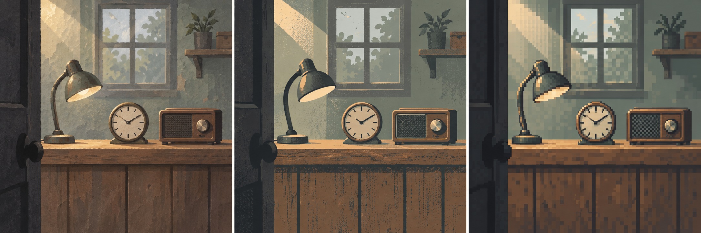

# 04｜策划案结构、配置样例与美术赛前准备

2026-09-24 · 命题前准备稿 · [01 玩家与方向](01_TapTap风向与玩家分析.md) · [02 Demo 元素与体验](02_Demo元素与玩家体验.md) · [03 工作计划与关卡推演](03_工作计划与关卡推演.md)

## 1. 本稿要交付什么

本稿把“拆件修补铺”的候选想法整理成之后可以填写、制作和交接的结构：正式策划案各章写什么，哪些数值放进配置，程序如何读取，美术如何先校准方向。它与前三稿共同用于讨论，**尚未成为正式参赛方案**，不修改 `planning/current.json`，不向 `game/` 写入候选玩法或资源。

目前三位程序 Godot 经验较少，两位美术偏 UI／二维。保留每人 12 小时的精简容量基线；确有必要时允许扩展至每人最多 24 小时，沟通、接入、返修与检查均计入。第三稿建议总投入 162 人时，192 人时仅为八人全部到达上限的理论总量。准备练习与正式制作分开记录，比赛对赛前成果的复用要求仍需核清。

同目录的[候选配置 JSON](fixtures/修补铺候选配置.json)是标准版 3 回合、6 订单的数据样例，用来核对规则与字段。它没有被游戏加载，视觉资源键也没有绑定实际文件。本文提出的参考目录和 approved 样例位置均为建议，创建、试作和认可后才能写“已完成”。

## 2. 正式策划案怎样组织

命题公布后，先由队长判断候选核心动作能否承接命题，再以一份总案说明完整体验。当前体量不需要为每个按钮拆出子策划案；配置、资源清单和测试用例作为同一规则的配套材料。

| 正式总案章节 | 本章回答的问题与交付内容 | 对应需求 | 主要使用者 |
|---|---|---|---|
| 0. 版本、命题与制作范围 | 本版被谁采用、为何适配命题、目标平台、采用标准版还是精简版；写明本版新增和删减 | E01—E09 的本版范围 | 全员 |
| 1. 玩家与体验目标 | 谁来玩、需要具备什么能力、希望经历什么；给首单与整局的体验验收目标 | E01、E03、E05、E06 | 策划、测试、美术 |
| 2. 完整流程与界面信息 | 开局、营业、选件、安装预览、交付、打烊、收束；采购、拆取和重试的返回位置 | E01—E09 | 三位程序、UI、美术、测试 |
| 3. 修补与订单规则 | 对象与归属、槽位、选中和实际扣除的差别、切换订单、拒单、重复点击、未完成订单处理 | E01、E02、E03 | 副程序 A、B、测试 |
| 4. 经营与恢复 | 供给、现金、日结、跨轮库存、采购、一次拆取、失败、整局重开、回合快照 | E04、E05、E07、E08、E09 | 主程序、副程序 A、测试 |
| 5. 回合与剧情 | 每轮学什么、比较什么、得到什么回应；每条线索在哪出现、依赖何种已发生的操作 | E01、E03、E05、E06、E08 | 策划、副程序 B、美术、测试 |
| 6. 资源与表现 | 场景分层、人物、物件差分、UI、字体、音效、使用位置与来源；分别统计独立资源与复用状态 | E02、E05、E06、E07 | 两位美术、副程序 B、运营 |
| 7. 配置与接口 | 本稿第 4—6 节的正式取值；维护者、读取时点、对象引用、运行态与配置边界 | E02—E09 | 策划、三位程序、测试 |
| 8. 验收与排期 | 对照需求 ID 检查结果、玩家理解和包体；列关键节点、责任人及已确认工时 | E01—E09 | 队长、测试、主程序、运营 |

正文说明行为与理由；流程图说明先后、分支和返回；界面图说明位置与玩家能看见的信息；配置表承载可调整数值。相同规则只维护一个明确来源，其他位置用需求 ID 引用。

### 需求 ID 怎样贯穿制作

| ID | 固定含义 | 程序／美术需要落实的内容 | 验收时观察什么 |
|---|---|---|---|
| E01 | 安全教学与独立练习 | 先一槽再两槽；教学提示跟随当前步骤 | 玩家能从被提示操作过渡到独立完成 |
| E02 | 两种零件与固定槽位 | C 线圈、G 齿轮；每单最多两槽；名称、图标和数量共同呈现 | 错误类型不安装；选择与取下均不扣真实库存 |
| E03 | 两张可比较订单 | 需求、报酬、当前状态同时可查；明确交付和拒单 | 切换不收费，完成只结算一次，拒单后可继续 |
| E04 | 现金、供给与日结 | 供给先展示；交付、采购、日结是现金变化入口 | 费用、库存保留、零现金继续及负现金停业一致 |
| E05 | 有告知的一次拆取 | 从第二轮起可拆寄存收音机；确认前说明所得和无法完整归还的后果 | 取消无变化，确认后得到 C×1，本次尝试内不能复原 |
| E06 | 物件变化与短文本 | 预览修好与已交付分开；说明、刻痕、对白与回访分工 | 玩家能说明物件发生了什么；表现与实际状态一致 |
| E07 | 收束与整局重开 | 订单、现金、寄存物分别展示，无隐藏道德总分 | 无件可用仍可拒单或打烊；重开没有上局残留 |
| E08 | 第三轮与临时采购 | R2 可买 C×1／8 币；R3 可选 C×1／12 币或 G×1／6 币，每轮合计最多一次 | 价格与下一轮需求可查，现金足够才成交，次数按回合重置 |
| E09 | 回合重新尝试 | 标准版恢复本轮开始时完整快照 | 收入、支出、零件、订单、采购、收音机、剧情标记一起恢复 |

E01—E07 属于精简版必须保留的体验；E08、E09 为标准版扩展。采用两回合版本时，单独整理它的回合数据与结尾，不通过隐藏按钮掩盖仍在运行的标准版逻辑。

## 3. 先用一条业务结果约束字段

第一回合开始，现金为 10，取得 C×2、G×1。灯需要 C×1，交付收 4；钟需要 C×1、G×1，交付收 6。两单均完成后现金为 20，零件为 0；打烊扣 8，进入第二回合时现金为 12，再取得 C×1、G×1。

在第二回合选择钟、把 C 和 G 放进槽位时，真实现金仍为 12，真实库存仍为 C×1、G×1。界面另外显示“交付后：现金 21，C×0，G×0”。只有确认交付且检查通过，才同时扣零件、收 9 币、标记订单完成、发出人物回应。

如果改选灯，钟的待确认槽位清空；如果再次点击已经完成的钟，现金和零件保持；如果先采购 C，现金变为 4，库存变为 C×2、G×1，当前轮采购次数变为 1。随后完成两单、扣除日结费用，现金为 11。上述结果必须能从配置、逻辑和界面同时推导。

## 4. 配置只保留实际需要的五组内容

候选 JSON 包含 `settings`、`parts`、`items`、`rounds`、`orders`，另有文件版本与候选状态说明。五组数据放在同一文件中，便于策划检查和程序读取；无需先搭数据库、通用事件语言或专用编辑器。

共同约定：ID 使用固定英文标识，显示名称可修改；现金单位为“币”，零件单位为“个”，回合序号从 1 开始。表内“必填”表示没有默认值。示例值仅用于这份候选；空值、缺项和越界要在载入练习或构建检查中明确报告，不能悄悄变成 0。只有明确标了默认的可选字段才能补缺省值。

### 4.1 文件信息与 settings：一局的起点和少量公共数值

| 字段 | 类型／单位 | 默认与范围 | 候选值及用途 |
|---|---|---|---|
| `schema_version` | integer／版本号 | 必填；当前为 1 | `1`；主程序据此判断字段结构 |
| `status` | string／状态 | 必填；本文件固定 `candidate_pretheme` | 清楚标记尚未入赛 |
| `description` | string／说明 | 默认空串 | 文件用途与未接入说明 |
| `settings.initial_cash` | integer／币 | 必填；≥0 | `10`，只在整局初始化时使用 |
| `settings.initial_inventory` | object／个 | 必填；资源键引用 `parts.id`；整数≥0 | `{"C":0,"G":0}`；每轮供给在此基础上增加 |
| `settings.radio.item_id` | string／物件模板 ID | 必填；外键 `items.id` | `radio`；整局唯一寄存实例 |
| `settings.radio.from_round` | integer／回合序号 | 必填；须对应已有回合 | `2`，之前只可查看 |
| `settings.radio.yield` | object／个 | 必填；资源键引用 `parts.id`；正整数 | `{"C":1}`；未列出的资源产出为 0 |

收音机整局最多拆一次、拆后本次尝试内无法复原、拆前二次确认，均作为 E05 固定规则；本例不为它们追加可切换开关。每轮采购内容和价格见 `rounds`，正式调整时需重新检查资源路径。

### 4.2 parts：两种零件

| 字段 | 类型／单位 | 主键、引用与默认 | 示例 |
|---|---|---|---|
| `id` | string | 主键、必填、不重复 | `C` |
| `name` | string | 必填；供界面显示 | `线圈` |
| `icon_key` | string | 必填；资源语义键，接入时映射到实际文件 | `part_C` |

本例只允许 C、G 两种资源。数量映射中未填写的已知资源默认为 0，未知资源键直接报错。显示图标同时显示名称与数量，不能把 C／G 的区别全部交给颜色。

### 4.3 items：物件模板，不在这里保存玩家的东西

| 字段 | 类型／单位 | 主键、引用与默认 | 示例 |
|---|---|---|---|
| `id` | string | 主键、必填、不重复 | `lamp`、`clock`、`warmer`、`radio` |
| `name` | string | 必填 | `台灯` |
| `base_visual` | string | 必填；资源语义键 | `item_lamp_base` |
| `repaired_visual` | string 或 null | 默认 null；有维修订单的物件必填 | `item_lamp_repaired` |
| `dismantled_visual` | string 或 null | 默认 null；寄存收音机必填 | `item_radio_dismantled` |
| `description` | string | 默认空串；纯展示文案 | 物件痕迹和可观察细节 |

`items` 表示可以复用画面的物件类别。每张订单通过自己的 `id` 区分实际委托实例，后两轮出现钟不代表第一轮修好的同一台钟再次损坏。寄存收音机由 `settings.radio` 引用，独立保存唯一实例状态，不作为普通可交付订单。

一张钟的基础画面可以服务不同损坏情况；具体需要什么零件由订单写明。画面若清楚画出了某个断裂部位，就须与这一单的需求一致；不能用装饰性破损向玩家暗示错误配方。

### 4.4 rounds：当轮供给、开支与两张订单

| 字段 | 类型／单位 | 主键、引用与默认 | 示例 |
|---|---|---|---|
| `id` | string | 主键、必填、不重复 | `R2` |
| `number` | integer／回合序号 | 必填；1—3 连续且唯一 | `2` |
| `supply` | object／个 | 必填；键引用 `parts.id`，数量≥0 | `{"C":1,"G":1}` |
| `operating_fee` | integer／币 | 必填；≥0 | `8` |
| `order_ids` | string array | 必填；外键 `orders.id`；本例恰为 2 条、无重复 | `["R2_lamp","R2_clock"]` |
| `purchase_options` | object array | 必填；空数组表示当轮没有临时采购 | R2 为 `[{"part_id":"C","quantity":1,"price":8}]` |
| `purchase_options[].part_id` | string／资源 ID | 选项必填；外键 `parts.id`；当轮同资源只配一项 | `C` |
| `purchase_options[].quantity` | integer／个 | 选项必填；>0 | `1` |
| `purchase_options[].price` | integer／币 | 选项必填；≥0 | R3 的 C 为 `12`，G 为 `6` |
| `purchase_limit` | integer／次 | 必填；≥0；空选项时为 0 | R2、R3 为 `1`，指所有选项合计上限 |

进入下一轮时加一次供给，再生成该轮起始快照。回合重试恢复快照，不重新执行“加供给”；再次打开界面也不加供给。进入下一轮后，上一轮未交付订单结束，尚余零件原数保留。

采购用一至两个固定选项显示，不做商城、购物车和补货刷新。购买时按当前现金检查；先交付获得收入，再购买也允许。进入 R2 后、第一次交付／采购／拆取之前，就能查看 R3 的供给、两单需求和采购价，使保留零件的价值能够提前判断；该预告直接读下一条回合配置，不另抄一份数值。

### 4.5 orders：每单的配方、报酬与最少短文本

| 字段 | 类型／单位 | 主键、引用与默认 | 示例 |
|---|---|---|---|
| `id` | string | 主键、必填、不重复 | `R2_clock` |
| `item_id` | string | 必填；外键 `items.id`；不能引用寄存收音机 | `clock` |
| `customer` | string | 必填；本例枚举 `A`、`B`，对应两位静态人物 | `B` |
| `requirements` | object／个 | 必填；资源键引用 `parts.id`，正整数；总和 1—2 | `{"C":1,"G":1}` |
| `reward` | integer／币 | 必填；≥0 | `9` |
| `request_text` | string | 必填；展示需求，不执行规则 | `这次线圈和齿轮都需要更换。` |
| `delivered_text` | string | 默认空串；交付成功后展示一次 | `它又走起来了，谢谢。` |
| `declined_text` | string | 默认空串；拒单后展示 | `那我先把它带回去。` |

订单所属回合只在 `rounds.order_ids` 维护，每单在整局出现一次，不再复制 `round_id` 形成两处映射。无需单独配方表，每单最多两槽；如有相同配方先直接填写，当前规模不引入继承体系。

顾客对话、物品说明是显示内容。它们不通过特殊句子、标签或自然语言指令修改金币与库存。收音机回访目前只需“完整／已拆毁”两个明确分支，由策划提供短文本、副程序 B 按逻辑结果显示；暂不建立通用剧情条件语言。后续确需两个额外标记时，先写清标记名、置位动作和读取处。

### 标准版的完整数值清单

| 回合 | 新增供给 | 开支 | 订单 1 | 订单 2 | 扩展入口 |
|---|---|---:|---|---|---|
| R1 | C×2、G×1 | 8 | 灯：C×1 → 4 币 | 钟：C×1、G×1 → 6 币 | 教学；收音机只可查看 |
| R2 | C×1、G×1 | 8 | 灯：C×1 → 6 币 | 钟：C×1、G×1 → 9 币 | 采购、一次拆取、回合重试 |
| R3 | C×1、G×1 | 8 | 保温器：C×2 → 10 币 | 钟：G×2 → 8 币 | C×1／12 币或 G×1／6 币二选一采购；共享一次额度 |

初始现金 10，初始零件 0；基础供给在各轮进入时增加。R1 无采购；R2 可买 C×1／8 币；R3 可选 C×1／12 币或 G×1／6 币，两个选项合计限一次。寄存收音机从 R2 起整局最多拆一次，得到 C×1。两张订单可以自由决定先后，不能在配置中用数组位置强迫按顺序交付。

**检查一次跨轮规划：**R2 只交付灯，日结后现金 10，留下 G×1。进入 R3 得到供给后，库存 C×1、G×2；先交付钟，现金增至 18，G 归零；再花 12 买 C×1，现金为 6、库存 C×2；交付保温器得 10，最后扣 8，现金为 8，收音机完整。若刚进入 R3 就采购 C，现金 10 不足，按钮必须说明差额。交付顺序在这里有实际作用。

## 5. 配置、当前运行状态和操作预览分开保存

| 数据层 | 具体内容 | 谁能改变，何时读取 |
|---|---|---|
| 只读配置 | 本稿五组数据、文字、资源语义键 | 策划修改并提交；主程序载入检查；开局固定这一版，运行中不写回 |
| 一局运行态 | 当前轮、现金、C/G 库存、各订单 pending／delivered／declined、当轮购买次数、收音机 intact／dismantled、已实际触发的必要剧情标记、营业／结算／结束阶段 | 副程序 A 的逻辑在有效操作成功时更新；UI 只读显示结果 |
| 当前操作预览 | 所选订单、所选零件、槽位草稿、预计扣除与收入、当前提示 | 副程序 B 维护展示，实际可行性向逻辑查询；换单、交付成功、重试或重开时清空 |
| 回合起始快照 | 加完当轮供给、所有当轮操作开始前的一局运行态完整副本 | 主程序与副程序 A 对齐恢复入口；E09 读取；不可引用同一份可变库存对象 |

“装进槽位”只更新草稿。交付逻辑重新检查订单未完成、配方匹配且当前库存充足；通过后同一次处理内完成扣件、收款、订单状态和回应记录。失败时这些实际状态全部保持，并返回具体原因。

采购检查选项属于当前回合、共享次数和当前现金；拆取检查开放回合和收音机状态。界面禁用能减少误操作，实际逻辑仍须检查这几个真实条件。打烊费用只扣一次，现金等于 0 可继续，小于 0 进入停业结果。拒单无额外罚金；打烊确认后，剩余 pending 订单转为 declined，不带到下轮。

**E09 恢复必须包含收音机。** 若 R2 开始完整，当前尝试拆掉后重试 R2，应恢复完整和未获得额外零件的状态；若 R2 已拆并正常进入 R3，重试 R3 时它仍然已拆。重试还要恢复现金、库存、订单、购买次数和已触发的剧情标记，清空预览。若从当轮结算页重试，日结扣款也随快照撤销；推进到新回合后，重试目标是新回合。

整局重开从初始现金与初始库存重新进入 R1。此 Demo 暂不要求跨退出存档；“重新尝试本回合”和“下次打开游戏继续”是不同能力，不能在界面混写。

## 6. 谁生产，谁接收

| 交接对象 | 生产者 → 消费者 | 最少内容与接入顺序 |
|---|---|---|
| 正式规则与候选配置 | 策划 Rossgu25487 → 主程序 follerdf、副程序 A bcynuaa | 需求 ID、当前文档版本、实际路径、字段与完整样例；主程序先确认加载方式，再接逻辑 |
| 订单与经营结果 | 副程序 A → 副程序 B wangruijie21 | 当前状态、可否交付／采购／拆取、明确原因、处理结果；副程序 B 据此更新文字与差分 |
| 页面与状态规格 | 美术 A Aprilwwwang → 副程序 B | 区域、字体、按钮和信息层级、必要状态、源文件；副程序 B 建节点和引用 |
| 场景与物件资源 | 美术 B stephaniez1 → 副程序 B | 源稿、导出、尺寸、对齐点、层级、语义键与状态对应；副程序 B 接入后再核对 |
| 快照与整体流程 | 主程序＋副程序 A → 副程序 B、测试 | 同一恢复入口与包含字段；先在逻辑中验证，再接按钮，避免 UI 自行补库存 |
| 玩法与包体检查 | 策划＋独立测试 → 对应岗位、主程序 | 策划看规则与理解，测试看输入、资源、结算、恢复和包体；主程序统一合并交包 |

这里约定的是业务边界。实际函数名、文件位置和信号由主程序在开题后提出最小实现，三人共同确认一次即可；不用提前搭可支持任意经营游戏的框架。

## 7. 美术先校准三种方向

共同目标是固定修补铺里的低饱和气氛、清楚的工作台、有人使用过的物件，以及前中后景层次。可借鉴 REPLACED 截图的焦点和空间分层；这张参考不能直接证明像素动画、复杂光照与整套美术都适合本队工时。



*探索样张：左为低饱和纸片手绘，中为硬边套色，右为有限色大像素。用于讨论形状、色块和层次，尚未定稿。该图属于内置 image_gen 生成的平面预览，没有可编辑图层、透明独立物件或运行状态，不作为游戏运行资源；完整提示词见本文附录。样张不改变命题与官方赛前复用要求。*

样张还需主动简化：左列材质细节偏多，精简版应减少纹理和细小明暗；右列尚未通过严格像素网格检查，不能作为合格运行像素资产；植物、箱子等附加装饰可以删去。参考图的完成度不代表本队能在相同时间里交付可修改、可接入的资源。

| 方向 | 具体做法与适合之处 | 主要代价与取舍 | 本队建议 |
|---|---|---|---|
| A：低饱和纸片插画 | 轮廓简化，少量纸感纹理，冷灰环境配局部暖光；人物用拼贴式半身，旧物保留清楚外轮廓 | 纹理过多会变脏；不同来源的图容易光向与笔触不一；必须统一边缘和明度 | **优先校准。** 适合二维静态人物、局部差分与有人文感的旧物叙事 |
| B：硬边套色 | 3—5 个主要色块，清楚几何轮廓，少渐变；场景以色块遮挡形成层次 | 气氛较克制，需靠构图和文字表达旧物温度；避免过度图标化导致同类物件难区分 | 若 A 的绘制或风格统一耗时，转用 B；也可作为 UI 图标的简化方法 |
| C：有限色大像素 | 明确基础网格、有限色板与像素块；所有物件按统一像素密度制作，整数放大 | 修线与像素一致性需要经验；背景软化与像素前景混合容易产生观感冲突；生成图常有伪像素与断网格 | 仅在两位美术能快速交付规范源稿时选用；不因参考作品漂亮而默认采用 |

先选一条主线。A 场景配同风格简化图标可行，C 人物与未校准的写实背景混用会增加统一成本。临时拼贴仅供比较，进入正式资源前由美术 A、B 对齐画法与导出。

### 7.1 用一组明确参数开始校准

当前协作试作的窗口参考为 1152×720。下列参数只是第一次样例的建议，不在本轮改动共享工程设置；正式目标尺寸由主程序、策划与 UI 在开题时确定。

| 项目 | 第一次样例建议 | 判断依据 |
|---|---|---|
| 文字 | 1152×720 参考下，正文约 22 px，按钮约 22—24 px，标题约 30 px，辅助说明尽量不低于 18 px | 中文在真实运行尺寸阅读；不通过持续缩字号容纳超长文案 |
| 环境色 | 深灰绿 `#26332F`、灰绿 `#536158` | 用在景物和大块背景，降低杂色 |
| 阅读色 | 暖纸色 `#E7DFC9`、深文字 `#252B27` | 浅面板配深字；深背景上的短标题可用暖浅色 |
| 焦点色 | 旧黄铜 `#BE9660`、暖亮色 `#E7C889` | 集中给台灯、选中与局部修复反馈 |
| 警示色 | 克制的砖红 `#A95F50` | 配“将拆毁”等文字和明确图形；颜色单独不能承担后果说明 |
| 图层 | 远处墙面／货架；清晰顾客与柜台；两侧前景轮廓；独立 UI | 前景不跨过按钮、配方、物品信息和主要点击区域 |
| 景深 | 远景减少细节与对比，柔化提前画进素材；中景边缘清楚 | 先达到主体与背景分离；无需实时模糊、动态镜头或着色器 |
| 轮廓与状态 | 旧物保持同尺寸、对齐点与主要轮廓；修好仅替换必要局部 | 前后差分能辨认，不出现物件突然变形或跳位 |

这组色值用于讨论，不等同于已经通过可读性测试。先在目标尺寸检查深浅字与按钮的识别，再决定是否保留。纹理必须避开小字、资源数字和图标边缘。

### 7.2 引擎交接时讲清楚什么

- 美术 A 提供原生文字、组件布局和源资源；副程序 B 负责场景节点、控制逻辑、交互区域与引用。美术 B 提供分层源稿与必要导出，不同时修改副程序 B 的主场景。
- 每份资源注明画布尺寸、目标显示尺寸、透明区域、对齐点、前后层级、状态名和资源语义键。A／B 方向的位图可采用平滑显示；C 方向需统一像素密度、最近邻显示与整数缩放，由实际接入验证。不要对所有资源一律应用同一种过滤。
- 静态背景按层导出即可。人物和旧物保留透明背景与可继续修改的源稿。修复差分与基础图共用画布和对齐点，不能让副程序靠逐张猜位置。
- 中文字体先核对实际字形和可分发许可；系统字体可用于本机试验，正式包不能依赖某位成员电脑上独有的字体。
- 候选 JSON 的 `icon_key` 与 `*_visual` 是语义键。副程序 B 建最小资源对应关系，缺图时先用明确占位并列出未接入项；最终验收不能将占位图写成资源完成。

## 8. AI agent 的“预训练”按一次可复读的校准组织

本阶段能做的是固定参考、任务边界、提示词版本、正确样例和纠错记录，让每次接手的 agent 读取同一组材料。普通对话不意味着已训练模型权重，也不能保证跨任务保留长期记忆。无需先搭训练服务或批量生成素材库。

建议之后只维护一个简短的 `planning/art-reference/README.md`，放方向、色板、文字尺寸、图层要求、认可理由、来源和提示词记录；认可的少量自制或可合法分发样例放在 `planning/art-reference/approved/`。这两个位置尚未创建，正式采用路径前再由队长与美术确认。第三方参考只放可公开的链接、用途和许可说明；无分发权的图片留在仓库外。未认可的试图放本人 `.local/art-calibration/<role>/`，跨机器交接时另给实际取得方式。

`approved` 表示本队认可其某项用途，例如“此轮廓与色块可作为新物件参考”，不意味着已经允许带入比赛，也不表示它在所有尺寸和状态下都已通过。每次 agent 开工都读取固定材料和本次需求，不能用“我之前记住了”代替。

### 一次 60—90 分钟的中性样例

两位美术各做一次，不提前创作正式人物、剧情和修补铺成品：

1. **前 10—15 分钟：** 沿用已有工具，读取共同参考与本稿；明确本次选 A，或因实际能力改选 B／C。记录基准尺寸与一个要验证的问题。
2. **中间 35—45 分钟：** 美术 A 制作一张中性“物件资料卡”，含标题、两行说明、两个零件数字与一个按钮的必要状态；美术 B 用一个中性水壶或台灯画清楚前中后景，并给主体一个简单局部变化。只做这一组。
3. **随后 10—20 分钟：** 合到同一张参考尺寸画面，核对字、轮廓、状态和层次；有接入条件时由副程序 B 查看实际运行，否则明确“只通过静态预览”。
4. **最后 5—10 分钟：** 只修最影响识别的一处问题，保存源文件和实际导出，写一句保留／调整理由。时间到仍不清楚，就降低细节或换更熟悉的画法，不追加一整套新版本。

这次练习用于测出绘制与接入能力，也可修正第三稿工时估算。准备时间单列，不能用本机成功替代另一台机器的导入结果。

### 提示词和来源只记录必要信息

每次正式保留的样例，在同一份参考说明中记录：样例 ID 与路径、用途、作者／工具／模型（以实际可见信息为准）、日期、提示词版本与完整正文、参考输入的来源和使用权、生成与人工修改范围、源文件和导出位置、认可者与认可范围。工具未显示的 seed 或模型细节写“未提供”，不补造。

例如 `ART-CAL-01 / prompt v1` 表示第一次中性样例；修正后记 `v2：降低远景对比，保留人物轮廓` 并保存实际提示词。仅保留有比较或恢复价值的版本。AI 平面输出须标明平面图，不能将一张 PNG 写成拥有可编辑图层的源稿。

## 9. 可直接发给美术 A 的 agent

```text
你是本队美术 A（ui_art，Aprilwwwang）的 Codex 助手。当前任务是一次命题前 UI 校准，尚未开始正式游戏美术制作。先读取根 AGENTS.md、本稿第 7—8 节，以及实际存在的共同美术参考；若 approved 目录尚不存在，如实沿用本稿候选，不自行声称已定稿。

先检查当前目录、分支、未提交文件和本人绘图工具，保留已有工作。使用本人独立 clone/worktree；使用熟悉且已有的工具，不为这次练习自动安装完整工具链。默认选低饱和纸片插画方向，若实际操作不适合，说明具体原因后用更简单的硬边套色完成同一测试。

请在 60—90 分钟准备练习中，完成一张中性“物件资料卡”：标题、两行说明、线圈和齿轮的名称与数量、一个按钮的默认／悬停或焦点／按下／禁用状态。按 1152×720 参考画面检查，正文约 22 px；保留原生文字和可编辑组件，不将整张生成图冒充可编辑 UI。不画正式人物、剧情或整套菜单，不改共享工程设置和副程序 B 的场景文件。

先用现有资源与原生图形，必要时才使用已可用的生成工具，并如实记录来源、提示词和人工修改。未认可样例放本人 .local/art-calibration/ui_art/，说明它不会随 Git 自动交接。输出保留一份工作源稿与必要预览，说明实际尺寸、字体许可、按钮状态、可伸缩区域及副程序 B 需要接入的位置。

检查目标尺寸的中文字形、层级、对比、裁切与状态识别；有真实接入条件就配合检查，没有则明确未运行。只修最影响阅读的一处问题，时间到后交付结果、实际耗时和保留／调整理由。任务与验收引用 GitHub Issue，本机 handoff 只留恢复线索。提交仅包含本人获授权且适合公开的文件，未做的检查保留未执行。
```

## 10. 可直接发给美术 B 的 agent

```text
你是本队美术 B（visual_art，stephaniez1）的 Codex 助手。当前任务是一次命题前二维资源校准，尚未开始正式场景或角色生产。先读取根 AGENTS.md、本稿第 7—8 节，以及实际存在的共同参考。approved 尚未创建或没有人认可时，不自行把试图当作正式风格。

先检查当前目录、分支、未提交文件和本人绘图工具。只在本人独立 clone/worktree 中工作，保留已有内容。默认测试低饱和纸片插画；若这类画法明显超出本人能力，转为硬边套色完成同一构图，并说明时间和识别方面的理由。

请在 60—90 分钟内做一组中性样例：一张简化分层画面，远处墙面或货架、中间水壶或台灯、两侧少量前景轮廓；主体再做一个容易辨认的局部变化。保持主体两种状态的画布与对齐点一致，不追加人物、正式剧情、逐帧动画、复杂像素或动态光照。景深通过降低远景细节与对比、预先柔化和遮挡完成，主体留清晰边缘。

用已有工具保存实际可修改的源稿，并按需要导出透明图层或差分。若使用 AI 图像生成，记录工具、完整提示词版本、参考输入来源与人工修改；单张生成 PNG 明确写平面图，不声称带有可编辑图层。不把无分发权的参考图片上传公开仓库。

未认可样例放本人 .local/art-calibration/visual_art/，说明它不会随 Git 自动交接。交付一份源稿、必要导出、尺寸、对齐点、层级、透明与过滤建议、状态差异和来源记录。与美术 A 核对文字避让区域，由副程序 B 接入节点和引用；不改对方场景或共享设置。

检查 1152×720 参考尺寸下主体是否先被看到、局部变化能否识别、前景是否遮住操作、透明边缘是否干净。只修最影响识别的一处问题；运行未做时明确写静态检查。最后报告实际耗时、需要简化的细节及建议采用的画法，保留可恢复源文件，不批量生成整套游戏资产。
```

## 11. 准备做到什么程度就够了

| 赛前可以完成 | 命题与正式范围确定后再完成 |
|---|---|
| 明确总案章节职责、需求 ID、配置字段和样例；用纸面／小脚本核对数值 | 将命题与核心动作结合，确认最终规则与精简范围，建立被采用的依据 |
| 用中性物品验证源稿、导出、替换、文字与分层显示 | 正式人物、场景、物件、回访文本与结局资源 |
| 明确生产者、消费者和接入顺序；练习一次跨机器交接 | 按正式工单接入实际资源、处理实测问题 |
| 比较 A／B／C，一次样例校准、保留少量被认可的参考与提示词 | 依已认可方向制作清单内资源，记录实际工时和来源 |
| 核对练习产物是否可公开、是否具备合法使用权 | 依据官方赛前复用要求判断哪些成果可进入参赛包 |

本轮文档与配置的检查范围是字段、引用和候选数值一致；美术方向图只作探索。正式准备验收还须看到：成员本人能编辑源稿，接收者能取得和替换资源，字与状态在真实尺寸下可读，另一台机器能运行，失败或未执行项已明确留下。做到这些即可等待命题，不继续扩建通用框架或预制整套正式内容。

## 附录：本次方向对照图的实际生成记录

- 样例 ID：`ART-DIRECTION-01`；提示词版本：`v1`；生成日期：2026-09-24。
- 工具：内置 `image_gen`；模型具体版本和 seed 未提供。
- 产物：[美术方向对照.png](figures/美术方向对照.png)；SHA-256：`40ec55b150932506d652d024ce0604a44f6f63c50bca3976292159b8da44937d`。
- 用途：比较同一构图的纸片手绘、硬边套色和有限色大像素；未定稿，未作为运行资源接入。提示词要求控制构图，实际输出仍需检查差异与额外装饰。
- 来源说明：构图与美术约束见以下完整文字；本条记录不附第三方参考图片。后续素材采用仍须保留实际输入来源、工具使用条件与人工修改记录，不能从这张探索图推定整套资源均可公开或入赛。

<details>
<summary>展开实际使用的完整英文提示词；再次使用时保留版本并记录改动</summary>

```text
Use case: stylized-concept
Asset type: a single landscape art-direction comparison board for an original small 2D game, pre-theme research only.
Primary request: Create ONE wide triptych image, exactly THREE equally sized adjacent panels separated by slim plain neutral gutters. No headings, no captions, no lettering anywhere. Each panel depicts the SAME neutral repair-shop work counter using an IDENTICAL fixed camera, geometry, object arrangement and muted palette. This is a controlled comparison of three drawing methods suitable for a tiny team, with deliberately economical detail, not a polished AAA concept painting.
Shared scene in ALL THREE panels: straight-on slightly elevated view of a wooden counter occupying the lower middle, a dark simple doorframe along the left foreground edge, a softly simplified green-grey rear wall with a window in the upper middle and a small shelf to the right. On the counter are exactly THREE main repair objects, from left to right: one old desk lamp with a downward-facing metal shade, one round clock standing on a small base, and one rectangular tabletop radio with a circular tuning knob and a simple speaker grille. The clock face has tick marks but NO numerals. The radio has NO labels or letters. Repeat their silhouettes, scale, arrangement, and spacing faithfully across all panels. Do not add tools, bottles, books, papers, extra clocks or any other tabletop props.
Depth: dark near doorframe as a broad foreground silhouette; clean readable shapes and edges on the counter and the three objects in the middle plane; reduced contrast and softer detail on the distant wall, window and shelf. Preserve breathing room around the objects. Pixel panel achieves distant softness through simplified low-contrast large shapes rather than smearing pixels. The tabletop remains easy to read.
Lighting and palette: warm soft light from the UPPER LEFT in every panel; gentle warm highlights on old wood and metal; cool desaturated grey-green surroundings; dark charcoal foreground; off-white small highlights; a humane, quietly cared-for atmosphere around old everyday objects. Moderate contrast, legible midtones, no black crush.
Left panel: economical hand-painted PAPER-CUT ILLUSTRATION, matte gouache-like flat paper shapes with a little subtle texture, soft simplified material indication, understated imperfect contours. Clearly flat 2D illustration, limited layers and few values.
Middle panel: economical HARD-EDGED SPOT-COLOR PRINT / SCREENPRINT illustration, the same scene broken into a small number of flat color masses, restrained coarse print texture, firm graphic silhouettes, no tiny engraved detail.
Right panel: economical LIMITED-PALETTE CHUNKY PIXEL ART, consistent visible square pixel grid, simple bold pixel clusters, sharply stepped silhouettes, minimal dithering; the same three objects should each be readable at small size. No smooth painted edges in this panel.
Composition constraints: Same eye level, same crop and same layout across all three panels. Each panel is a complete small scene; do not blend scenes across panel boundaries. Prefer a 3:1 overall landscape composition. Keep the room intimate and the scene modest enough to recreate with two 2D artists working within 24 hours each.
Avoid: people, faces, characters, UI, HUD, labels, logos, watermark, text, dramatic cinematic lens effects, photorealism, 3D-rendered realism, elaborate microdetail, neon, cyberpunk, horror, blood, recognizable existing game IP, imitation of a specific game's scene.
```

</details>
